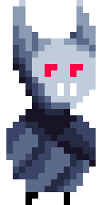

# Summer 2022 2D Game

## Abstract  

This project is my personnal summer project for the summer of 2022.
I am a student in the Hes-so Valais/Wallis Business IT bachelor program and my goal with this project is to practice and improve my programming skills during the break between the 2nd and 3rd semester of my studies.

I am following RyiSnow tutorials on Youtube https://www.youtube.com/playlist?list=PL_QPQmz5C6WUF-pOQDsbsKbaBZqXj4qSq

All sprites and designs are my own.

